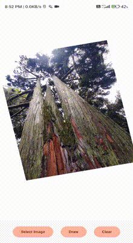

# DrawingSurfaceView
**app by sathwik**

### Video Preview



**A high-performance Android drawing component**

Supports image transformation and freehand drawing with background thread rendering.

---

## 📖 Overview

`DrawingSurfaceView` is a custom Android `SurfaceView` designed to provide an interactive canvas for both image manipulation (drag, zoom, rotate) and freehand drawing. It leverages background thread rendering for optimal performance.

---

## 🚀 Key Features

* **🖼️ Image Transformation**: Supports drag, zoom, and rotate gestures for manipulating a background image.
* **✍️ Freehand Drawing**: Allows users to draw freely on the canvas with customizable brush settings (color, size).
* **⚙️ Background Thread Rendering**: Utilizes a dedicated rendering thread (`DrawingThread`) to offload drawing operations from the main UI thread, ensuring smooth and responsive interactions even during complex rendering tasks.
* **✋ Multi-Touch Gestures**:
    * **Single-touch drag**: Repositions the image.
    * **Two-finger pinch**: Zooms the image in/out.
    * **Two-finger rotation**: Rotates the image.
    * **Drawing mode**: Captures touch paths for freehand drawing when enabled.
* **🧠 State Management**:
    * Integrated with `ImageTransformViewModel` for clean separation of rendering logic and state.
    * Centralizes control of transformation data and drawing attributes.
    * Supports state persistence across view lifecycle events.

---

## 🛠️ Usage

### 🔹 Initialization

```kotlin
val drawingSurface = DrawingSurfaceView(context, viewModel)

```
✍️ Enable/Disable Drawing Mode
```
viewModel.isInDrawingMode.value = true
viewModel.isInDrawingMode.value = false
```
// Disable drawing mode (allow image transformation)

📐 Listen for Surface Size Changes
React to changes in the view's dimensions, often needed to initialize or adjust drawing parameters.
```
drawingSurface.setOnSizeChangedListener { width, height ->
    // Handle new surface dimensions, e.g., update ViewModel or redraw elements
    Log.d("DrawingSurfaceView", "Surface size changed: $width x $height")
}
```
Android API Level: 21+
Kotlin Version: 1.4+ (or compatible)
📚 Documentation / Internal Workflow


* SurfaceView Lifecycle Integration
surfaceCreated(): Starts the DrawingThread and initializes the drawing surface and resources.
surfaceChanged(): Handles resizing. It updates the dimensions used by the rendering thread and may trigger recalculations for transformations.
surfaceDestroyed(): Safely shuts down the DrawingThread and releases associated resources (bitmaps, paints, etc.) to prevent memory leaks.
* Drawing Thread (DrawingThread) Workflow'
Draws the background image with current transformations (Matrix).
* Draws the freehand drawing paths onto the canvas.
* Unlocks and posts the updated Canvas using SurfaceHolder.unlockCanvasAndPost().
* Utilizes synchronization (synchronized blocks) to prevent concurrent modifications to shared resources (like drawing paths or transformation data) from the UI thread and the rendering thread.
* ViewModel (ImageTransformViewModel) Responsibilities
* The ImageTransformViewModel acts as the single source of truth for the view's state:
* Manages the current drawing mode state (isInDrawingMode).
* Holds the current brush attributes (color, stroke width).
* Stores the image transformation matrix components (scale, translation, rotation).
* This separation ensures the DrawingSurfaceView focuses solely on rendering and gesture handling, while the ViewModel manages the underlying data and logic, making the component more testable and lifecycle-aware.
